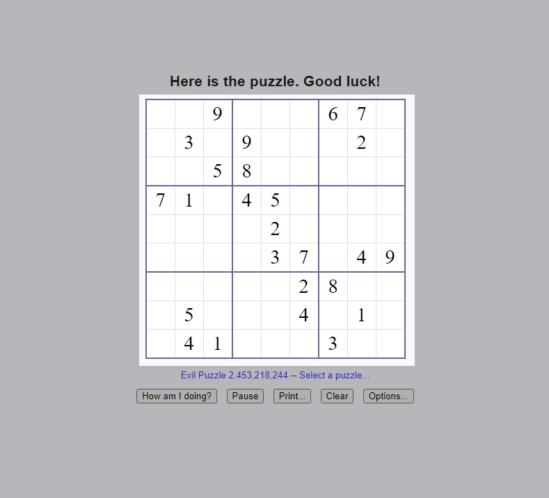
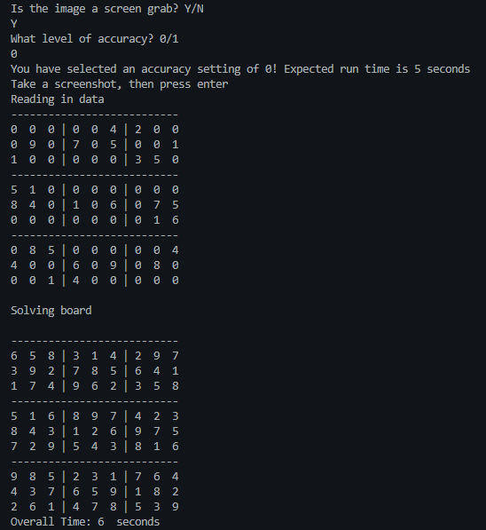

# PySudoku

A Python based sudoku solver that uses image recognition to read in the sudoku game and [Tech With Tim's sudoku solver](https://techwithtim.net/tutorials/python-programming/sudoku-solver-backtracking/).

## Technology

- Python 3.7
- Tesseract

## Sample Input

When taking the photo or screenshot, select only the sudoku game

## Sample Output

## Installation

- Clone this repository
- Create a virtual environment with python -m venv venv
- Activate virtual environment with venv\Scripts\activate.bat on Windows, venv/ Scripts/activate on Mac / Linux, venv\Scripts\activate.ps1 on PowerShell
- Install requirements with pip install -r requirements.txt
- Install Tesseract [More information](https://github.com/tesseract-ocr/tesseract/wiki)
